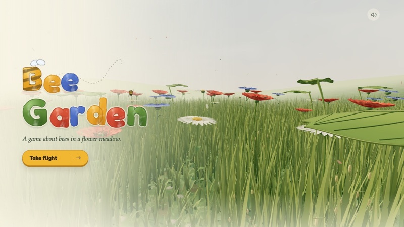

# Bee Garden



A first-person watercolor meadow game. You are one honeybee, out for a single
summer's day: fly among poppies, daisies and cornflowers, land on their moving
petals, gather nectar and pollen, shelter from the weather, and get home before
dark. Whatever you pollinate shapes the meadow you find the next summer.

**[Play it in your browser](https://arnicas.github.io/bee-garden-game/)**, on a
desktop or laptop with a keyboard. It isn't set up for phones or tablets yet.

Built by me (arnicas) as critique/direction/director and GPT Astra Extra High as
developer. Claude Opus 5.5 is now helping with UX fixes. (The text hasn't been
fully scrubbed of AI twee yet.)

<p>
  
  
</p>

## How to play

You start the day on a daisy with 60% energy. Sip nectar (hold **F**), walk through
flowers' centres to gather pollen, and carry it to another flower of the same kind to
pollinate it. Shelter from rain and the hot sun under a broad leaf or down in the grass,
and fly home before dark: once you have enough, a marker shows the way. What you
pollinate shapes next summer's meadow.

| Action | Keys |
| --- | --- |
| Fly or walk | **W** goes where you look; **S** back; **A**/**D** sideways |
| Look | Arrow keys, or click the meadow to steer with the mouse |
| Rise / take off | **Space** |
| Drop down into the grass | **Ctrl** |
| Land, shelter, rest | **E** when the E cue appears (on a flower, on or under a leaf, in the grass) |
| Sip nectar or water | Hold **F** (or the left mouse button) |
| Bee Vision | **Q** shows flowers you haven't visited, and the ones your pollen matches |
| Head home early | **R** |
| Photo | **P** saves the view as a picture |
| Pause, controls and facts | **Esc** |
| Sound | **M** |

The [player guide](docs/player-guide.md) has the rest: weather and shelter, the small
lives to find in the meadow, how the summers change, bee lore, Bee and Meadow Facts,
accessibility, and the full rules and numbers.

## Docs

- [Player guide](docs/player-guide.md): how to play, and the full rules and numbers.
- [Developer guide](docs/development.md): setup, source map, tuning, tests and debugging, hosting.
- [Design notes](docs/design/): seasons and moisture, snails, meadow health, pollination across summers.
- [Research](docs/research/): flower facts, the meadow fact check, bee folklore.
- [TODO](TODO.md): open work, and what is done.
- [Showcase video](video/README.md): how the trailer is made.

## Quick start

With Node 22.12 or later and a desktop browser with WebGL2:

```sh
npm ci
npm run dev
```

Then open [the development server](http://127.0.0.1:5188/). Builds, tests and
deployment are in the [developer guide](docs/development.md).

## License

Licensed under the [MIT License](LICENSE). Copyright © 2026 Lynn Cherny.
