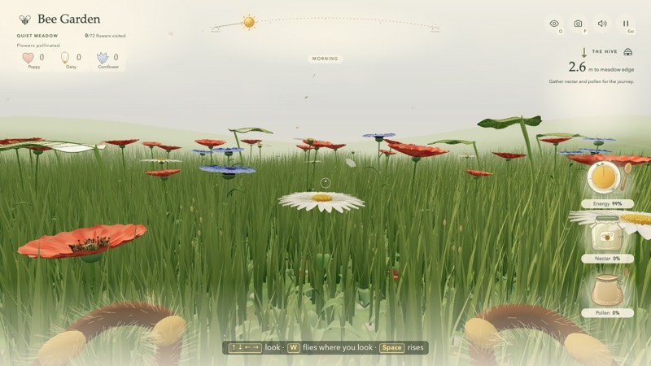
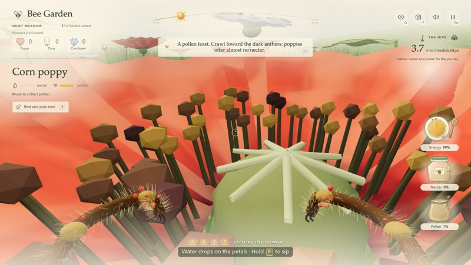
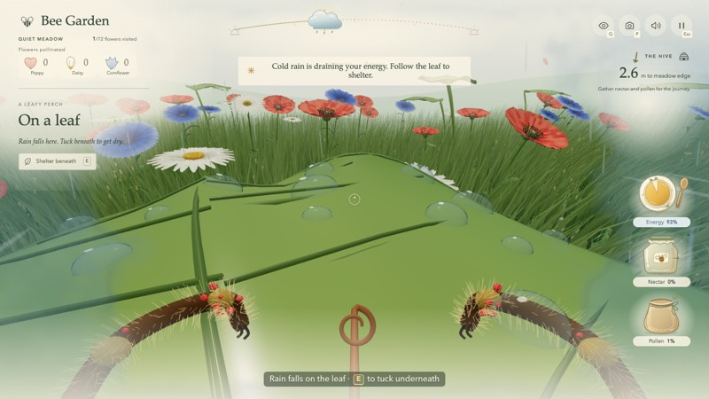
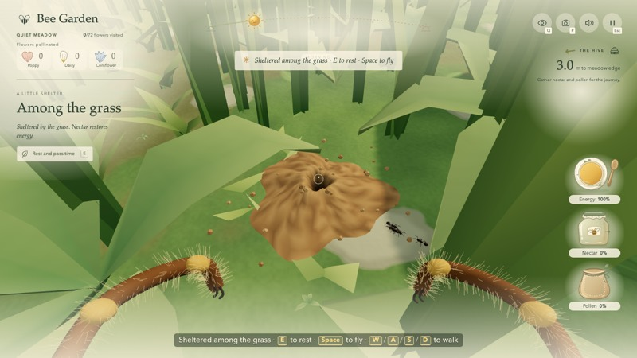
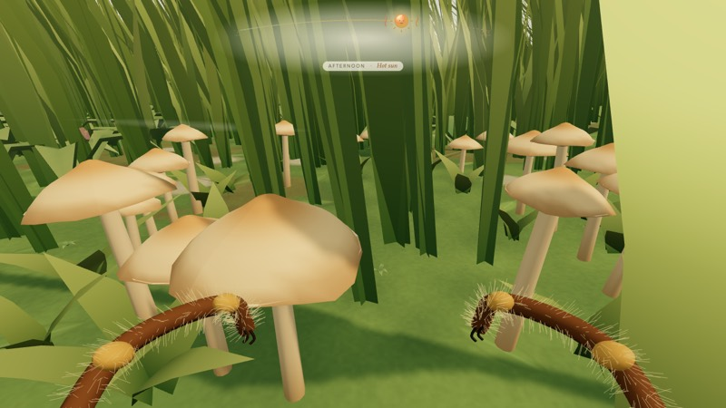
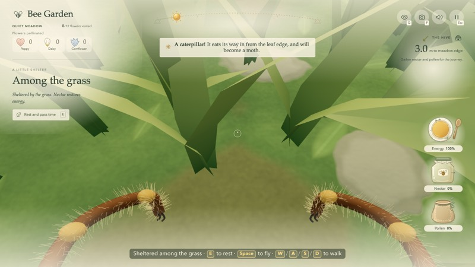
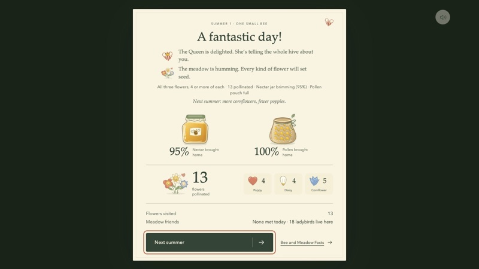
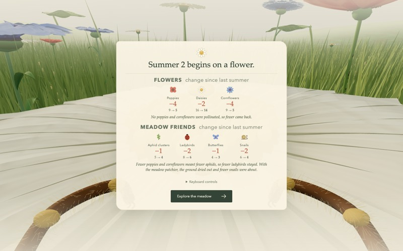
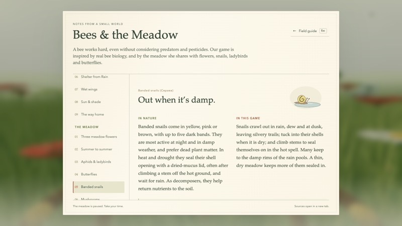
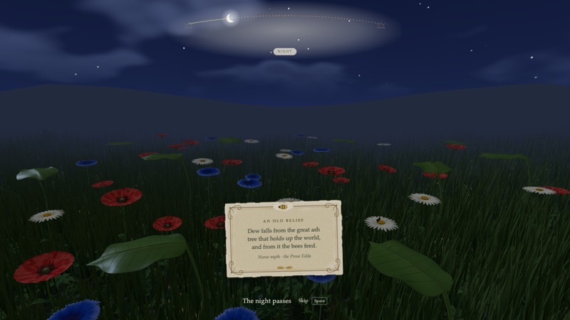

# Bee Garden player guide

How to play, then the full rules and numbers. Back to the [README](../README.md).

## Playing

  
  

### Your day

- **Start on a daisy.** Sip its nectar first (hold **F**): you begin the day
  with 60% energy, and flying uses it up.
- **Gather.** Nectar fills the jar and pollen the pouch. Walk through a
  flower's centre to pick up pollen. Poppies are all pollen and no nectar,
  cornflowers hide their nectar in the tiny florets at the centre (walk from
  one gold bead to the next while holding F), and daisies offer some of each.
- **Pollinate.** Pollen on your legs pollinates the next flower *of the same
  kind* you land on. The flowers you pollinate are counted at the top left.
- **Mind the weather.** Rain chills you and raindrops can knock you down, and
  the hot spell overheats you. Tuck under a broad leaf or down into the grass.
  Sip from dew, raindrops and rain pools to cool off.
- **Go home.** Once the jar and pouch hold enough, a marker points to the
  meadow edge nearest the hive. You can also head home early with **R**,
  or by flying out past that edge, where the hive arrow (top right) points.
  If you stay out past sunset, the day ends without you.

The results screen tells you how the day went. It also shows how your
pollination will change next summer's meadow: more of the flowers you helped,
fewer of the ones you didn't, and the friends that depend on them.

### Controls

| Action | Keys |
| --- | --- |
| Fly or walk | **W** goes where you look; **S** back; **A**/**D** sideways |
| Look | Arrow keys, or click the meadow to steer with the mouse |
| Rise / take off | **Space** |
| Drop down into the grass | **Ctrl** |
| Land, shelter, rest | **E** when the E cue appears (on a flower, on or under a leaf, in the grass) |
| Sip nectar or water | Hold **F** (or the left mouse button) |
| Bee Vision | **Q** shows flowers you haven't visited, and the ones your pollen matches |
| Head home early | **R** |
| Photo | **P** saves the view as a picture |
| Pause, controls and facts | **Esc** |
| Sound | **M** |

Esc opens a short field guide with the rest of the controls and some tips.

### Weather and shelter

Every day brings its own weather: none, one or two showers, a hot spell, and a
windy spell or two. The night before matters too. After rain in the night the
leaves are wet, the pools are full and mushrooms are up. After a dry night
there is no dew. Blue watercolor edges mean you're cold or tired, orange means
you're too hot. Broad leaves are the best shelter, and the grass will do,
though drips still find you there. Resting (E) passes time and turns stored
nectar into energy.

### Things to find

  
  
  

The meadow is full of small lives, best found by flying low or walking in the
grass. Each one is counted when you get a good look at it:

- **Ladybirds** on the stems, eating aphids
- **Butterflies** sipping at daisies and cornflowers, sheltering under leaves in rain
- **Snails** out in the damp, at the edges of the pools and on the leaves
- **Ant trails** from a soil mound up a stem to the aphids
- **Mushrooms** by the water after rain, and one rare **fairy ring**
- **Fallen petals** under the flowers (a pollinated poppy soon drops one)
- **Caterpillars** eating their way in from the leaf edges

No spiders are shown, but their webs hang low in the grass. Fly into one and
you'll need to tug free (tap Space or W).

### Summer after summer

  
  

Each round is one day that stands for a whole summer. Poppies and cornflowers
are annuals: the ones you pollinate set seed, and next summer there are more
of them, while unpollinated kinds thin out. Daisies are perennials and change
slowly. The meadow's friends follow the flowers: aphids and ladybirds follow the
poppies and cornflowers, butterflies want the nectar flowers, and snails stay
where the meadow is full and damp.

### Bees and the meadow

**Bee and Meadow Facts** (from Esc, or the results screen) has illustrated pages
on bees and on the meadow: what's true in nature, what the game simplifies, how
to spot each friend, and links to sources.

While you rest, in the quiet view over the meadow and in the night between summers, small **bee lore** cards appear now and then: old beliefs, what people once thought, and old verse, each with its source. Turn them off in the Esc menu.

### Accessibility

Menus work from the keyboard, and pollination has a text announcement. Your
system's **Reduce motion** setting is read when the game loads: it calms
ambient motion and uses still views for the cinematic moments. Sound can be
muted at any time. The game still depends on moving through a 3D view.

---

## Game rules in detail

The sections above are the short version; this is the full set of rules
and numbers, for tuning and testing.

Choose **Take flight** to start perched on a daisy with the keyboard guide open.
Reading and trying the guide's keys costs no energy or daylight. Choose
**Explore the meadow**, Enter or Esc to begin on the flower; Space takes off.
The opening daisy is visited but its supplies are untouched. Each day starts
at 60% energy, so sipping its nectar is a good first step.

### All controls

| Action | Control |
| --- | --- |
| Fly or crawl | W moves where you look, including up/down; S reverses; A/D move sideways |
| Look | ↑ ↓ ← →; optionally click the meadow to capture the mouse, or drag if capture is unavailable |
| Rise / take off | Space; also cancels an assisted landing and overrides downward flight |
| Descend | Look down and use W; Ctrl is an optional shortcut |
| Steady / brake | Optional Shift; normal flight and landing do not require it |
| Land | E when the small E cue appears; the bee slows and settles onto the moving flower |
| Leaf perch / shelter | E lands on top in mild weather or underneath in rain/hot sun; E from an exposed top moves into shelter |
| Rest / wake | E while settled, or the left-side rest button; walking, F or Space also ends a rest |
| Sip nectar | Aim at the golden nectar and **hold F or the left mouse button** |
| Bee Vision | Q |
| Pull free of a spider web | Tap Space or W (holding also works, more slowly) |
| Way home | R heads home at any time (it needs 5 nectar for the flight); then fly to the hive-facing meadow edge. With the harvest goal met, the marker appears by itself |
| Pause / release mouse | Esc during play; losing focus or switching tabs also pauses |
| Bee and Meadow Facts | Esc → Bee and Meadow Facts, or the link on either results screen |
| Sound | M or the speaker button |
| Save a picture | P saves the 3D view (without the HUD) as a PNG; it doesn't wake a resting bee. `beeGarden.screenshot()` in the browser console does the same. System screenshot shortcuts (Cmd+Shift+4) no longer wake the quiet view either |
| Skip a closing scene | Space, Enter, left-click the meadow or the skip button |
| Wake the quiet view | Any key or click; the first gesture restores the view, so press again to act |

Esc's field guide includes the core controls and short gameplay tips. Optional
mouse/Ctrl/Shift controls can be expanded there. Esc on the title screen does
not open this guide.

### Gathering and pollination

Walk through a flower's central pollen to gather it. Landing, standing still,
outer petals and flower sway do not collect pollen. The visible grains disappear
as the finite supply is used, and remain depleted on revisits.

| Flower | Usable pollen in a full flower | Usable nectar in a full flower |
| --- | ---: | ---: |
| Corn poppy | 21 | 0 |
| Oxeye daisy | 14 | 13 |
| Cornflower | 10 | 28 |

Poppies are the pollen flower, cornflowers the nectar flower, and daisies sit in
between. The balance loosely follows real meadow measurements; see
[Flower_Facts.md](research/Flower_Facts.md) for the research and sources.

Nectar is shared between personal energy and storage. F/left-click sips directly
from the flower: it restores energy first, then puts the remainder in the jar.
It works even when the jar is full if the bee still needs energy. With both
full, the tongue curls away and sipping stops. Poppies offer pollen only.

The HUD shows energy on a plate, nectar in a jar and pollen in a pouch, each as
a percentage (the jar holds 100 nectar, the pouch 140 pollen; the hive's nectar
goal is the 45% mark). The results screen uses the same percentages. The left
flower panel shows what the flower still offers as two small bars on one scale
per resource: a fresh cornflower fills the nectar bar and a fresh poppy the
pollen bar, so a daisy's bars sit about halfway. It also shows a
short collection reminder. More cargo gradually slows flight. From about 60%
full the bee wobbles, sags and strains: quick beats dip the view and deepen the
wing hum, and a hint says to follow the hive marker home. Shift halves the
wobble.

Loose pollen on the legs is separate from stored cargo. Carry it to another
flower of the same species to pollinate that flower once. A small flower **+1**
badge, pollen effect and chime confirm the transfer. Walking can replenish loose
pollen even with a full storage pouch; harvesting stops only when both storage
and the current coating have no room, or the flower is empty.

The newest loose pollen appears on the foreleg knuckles in red, cream or blue,
with smaller flecks for other carried types. These colors are a visual game aid.
Q highlights unvisited flowers; matching flowers pulse when you carry their
pollen. Visited flowers lose their flight guide, but E still allows revisits.
The meadow tally counts unique pollinated flowers and tracks all three species.
Its heading shows the meadow's mood (Quiet, Waking, Happy, All three happy) and
how many of the 72 flowers you have visited. A flower you pollinated shows a
small bloom of its species in the flower panel. Helping all three is optional,
not a requirement for returning home.

### Energy, weather and rest

Flying spends energy. Releasing movement lets the breeze carry you at lower
cost; steering into strong wind costs more. Low air near grass is calmer. The
swaying grass and flowers show the wind; stacked wavy lines beside the sun mark
a heavy-wind spell.

When energy drops below 38 (as the blue edges begin), a message at the top says
to find a daisy or cornflower and sip nectar; below 18 a stronger “Almost out of
energy” message follows. Each shows once per dip and returns after refueling to
50. Rain and heat have their own warnings, so the first one waits while those
apply.

Stored nectar automatically feeds a bee with low energy. A full nectar jar also
starts a meal if energy needs topping up. **Rest does not create food**: a
six-second E rest uses stored nectar to restore up to 36 energy while advancing
daylight about 108 seconds. With no nectar, it only saves energy. The left-side
label reads “Resting · time passes” (before resting, “Rest and pass time”) and a small sleeping bee appears in the lower
left during this state. E cancels it; looking around
with arrow keys does not. No flower supplies are collected during rest.

Each day rolls its own weather: the night before (wet, dewy or dry), none to
two showers, a hot spell most often from midday into mid-afternoon, and one or
two heavy-wind spells. After a wet night the leaves start wet, the rain pools
are part full, mushrooms are up, the dew is heavier and the ants come out late;
after a dry night there is no dew and the snails stay in their shells. A line
after the welcome says which. Shelter helps with all three kinds of weather:

- **Blue watercolor edges** mean low energy or accumulating cold. Flower heads
  and leaf tops are exposed to rain; leaf undersides and dense grass shelter you.
- **Orange edges** mean overheating. Use E to tuck beneath a broad leaf, or
  settle into dense grass near the ground. Cover stops the direct exposure cost
  while the bee gradually warms or cools; nectar still supplies energy recovery.
- The daylight strip shows current conditions. Its rain cloud appears only
  after rain starts; the sun moves out as it clears. Drops stop and “Dry again”
  appears when the shower is over. A warm sun and heat waves mark hot weather.
- **Heavy wind** holds the gusts up and makes them about a third stronger for a
  minute or two. Fly low, perch or shelter in the grass to save energy. Wavy
  lines and a “Heavy wind” caption appear on the strip, and short messages mark
  its rise and easing.

Rain also changes the broad leaves: they darken and turn shinier, then dry over
about half a minute. Perched on or just above a leaf top in rain, the patter is
louder, with occasional drop “plinks” (softer and lower from underneath).

### Meadow friends and finds

Getting close to one, with it in view for a moment (on screen and not behind a
leaf), counts it for the day. The first of each kind brings a short note with
its name in bold, and the results screen lists them under “Meadow friends” and
“Found in the grass”.

- **Ladybirds** (`friends.ts`): about 18 a day, on stems, leaves and the ground.
  They walk to the aphid clusters on poppy and cornflower stems and eat them down.
- **Butterflies** (`butterflies.ts`): four kinds sip real nectar from daisies and
  cornflowers, bask in sun, and shelter under leaves or in the grass in rain.
- **Snails** (`snails.ts`): out in rain, dew and at dusk, at the pool rims and on
  the leaves; they seal themselves on stems in the hot spell.
- **Ant trails** (`ants.ts`): four colonies, each a soil mound with a trail to
  an aphid-covered stem. The ants step around the bee and go home in rain.
- **Mushrooms** (`mushrooms.ts`): clumps at about half the pools and one full
  fairy ring (a rare find, with a chime) come up after rain, shrivel in the heat
  and revive in the next rain.
- **Fallen petals** (`petals.ts`): poppy petals and daisy rays under the flowers;
  a poppy you pollinate drops a petal a little later.
- **Caterpillars** (`caterpillars.ts`): five on the broad leaves, eating bites
  into the leaf edges (cut out in the leaf shader).

Water: dew and raindrops on petals and the rain pools (`puddles.ts`) can be
sipped with F. Sipping cools the bee; it isn't food.

### Spider webs in the grass

The grass is a refuge from rain, heat and wind, but not a free one: about 28
orb webs hang low between the stems each day, some fresh and fairly neat, most
old, sagging and gappy. They keep clear of the opening flower and the broad
leaves, which stay the reliably safe shelter. No spiders are shown.

Dry webs are faint silver threads. Morning dew leaves a few clear drops on them,
and after rain they carry many, which makes them easier to spot. Bee Vision (Q)
tints the silk pale violet and brightens it a little (real orb-web silk reflects
ultraviolet), though webs still hide behind grass and petals.

Flying or walking into a web catches the bee. Tap Space or W to pull free
(holding either also works, more slowly). Each tug costs a little energy: about
six taps for a light bee, nearly twice that with a full load, fewer when nearly
exhausted. A web never ends the day by itself; below 6 energy the bee slips out.
Breaking free leaves that web torn for the rest of the day.

Warnings precede the steep weather drain, but ordinary flight keeps using
energy. E chooses a leaf's underside during rain, hot sun or lingering heat.
In mild weather it offers the top. Descending to the soil lands automatically;
E also settles the bee when already deep in grass. Space leaves either refuge.

After eight safe, quiet seconds on a perch, the HUD fades. After twenty-two,
the camera rises into a slow meadow view, with worker bees in sunshine and a
small breathing sleeping bee in the lower left. Any key
or click returns to the bee. The day strip remains visible while sheltered.
Danger and sunset restore the UI. This scenic rest does not repeat the feeding
or accelerated daylight of the six-second E rest.

### Finishing the day

The hive's goal is **45 nectar and 140 pollen**, plus 5 nectar for the final
offscreen flight. Once the goal is met, the hive marker appears; follow it to
the meadow edge while airborne and arrival starts the ending by itself.

The bee may also head home earlier with whatever it carries: press R (or the
Way home button) with at least 5 nectar in the jar. The marker and a “Heading
home early” label appear, and arriving at the edge ends the day. Before that
choice, the edge never ends the day by accident. R cannot skip the crossing.
Keep an eye on nectar used for energy along the way.

The ending rises above the working meadow, approaches the hive, shows two bees
landing and making small simulated waggle dances, then fades to totals. The
5 nectar is deducted once. The dance is decorative and does not encode flower
locations. Esc pauses the scene and M mutes it.

A day lasts **600 simulated daylight seconds**. Rest advances this clock faster;
pause freezes it. Sunset at 540 seconds wakes a resting bee and gives a final
minute's warning. At nightfall, a short harvest ends beneath charcoal watercolor
clouds. A harvest ready at that moment can still finish the ordinary flight home,
paying normal energy costs and meeting the same arrival requirements. Zero energy
at any time instead triggers the exhaustion ending.

Getting home is judged on two things, and pollination counts for more:

| | All three kinds, 4+ each | All three kinds | 3+ pollinated | 0–2 pollinated |
| --- | --- | --- | --- | --- |
| **Brimming** (85+ nectar, full pouch) | Fantastic | Good | Reasonable | Okay |
| **Full** (45+ nectar, full pouch) | Good | Good | Reasonable | Okay |
| **Partial** (less) | Reasonable | Reasonable | Okay | Okay |

The results screen names the day (“A fantastic day!”, “A good day”, “A
reasonable day”, “An okay day”), with a line from the Queen, a line about the
meadow, a short line of the stats behind it, and on the lower tiers one tip
aimed at the weakest stat (for example the kind of flower that was missed).
Thresholds and wording live in [src/day-report.ts](../src/day-report.ts). Not
getting home (exhaustion or nightfall) keeps its own ending and advice, with
the same stats line.

Each round is one day that stands for a whole **summer**. Both results screens
retain gathered totals, look ahead to next summer ("Next summer: more poppies,
fewer ladybirds.") and offer **About bees** and **Next summer**. A finished
round, home or not, grows the next meadow from what was pollinated
([src/meadow-plan.ts](../src/meadow-plan.ts)):

- Poppies and cornflowers are annuals: next summer's number follows how many
  were pollinated (normal × (0.3 + 0.2 per pollinated), up to 1.8×), and
  seedlings sprout where pollinated flowers stood, around them, and (most of
  them) blown across the meadow, so it's denser where you worked without
  splitting into patches.
  Unpollinated ones leave gaps. A small seed bank brings a kind back, shrinking
  after summers in a row with none pollinated, down to one flower.
- Oxeye daisies are perennials: they keep their places and change about ±12%
  a summer.
- Aphid clusters follow the poppies and cornflowers; ladybirds follow the
  aphids and daisies; butterflies follow the daisies and cornflowers (they want
  nectar only) and sip a little from the flowers they sit on; snails follow how
  full the meadow is (a thin one dries the ground and keeps more of them sealed).
  The six opening flowers never change.

Summers are counted through the session (restarting a round doesn't count, and
keeps its meadow); each new one resets supplies, cargo and pollination and rolls
new weather. From the second summer, the start page shows how the flowers and
friends changed since last summer. There is no persistent save yet. Test pages
(`?test`) keep one meadow; add `?summers` to let it change.

### Bee and Meadow Facts

Seventeen illustrated topics in two sections, bees and the meadow, each
comparing “In nature” with “In this game”; the meadow pages also say where to
look for each friend. The text, species qualifications and research links live
in [src/bee-facts.ts](../src/bee-facts.ts). Sources open in a new tab. Topic
buttons and arrow keys navigate; Esc returns to the field guide or the results.
